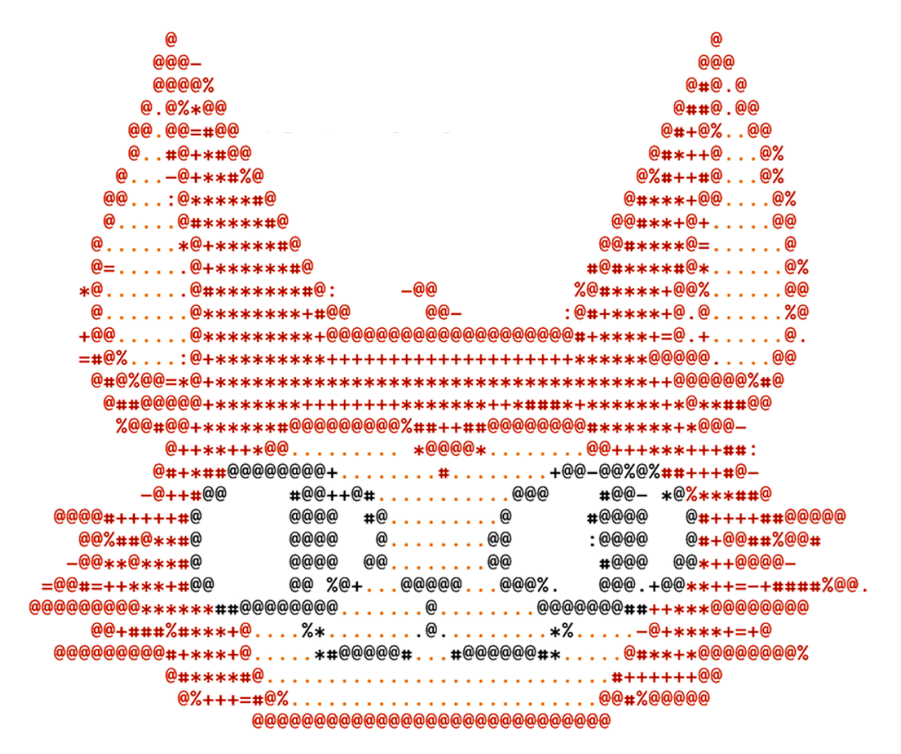

<p align="center">
  
</p>

<h1 align="center">StrucTTY</h1>

<p align="center">
  <b>Interactive, Terminal-Native Protein Structure Viewer</b>
</p>

<p align="center">
  <a href="#-installation"></a>
  <a href="#-installation"></a>
  <a href="LICENSE"></a>
  <a href="https://github.com/steineggerlab/StrucTTY"></a>
</p>

---

**StrucTTY** is a lightweight, terminal-based protein structure visualizer built in C++17. It renders 3D protein structures directly in the terminal using **Unicode Braille sub-pixel rendering**, providing 8x resolution compared to standard character-based rendering.

StrucTTY supports simultaneous visualization of up to 6 proteins, 7 color modes with 3-band depth fog, and integrates with **Foldseek** and **FoldMason** for structural search and multiple structure alignment.

## Features

- **Braille sub-pixel rendering** — each terminal cell maps to a 2×4 logical pixel grid
- **Up to 6 proteins** rendered simultaneously with independent controls
- **7 color modes** — `protein`, `chain`, `rainbow`, `plddt`, `interface`, `conservation`, `aligned`
- **3-band depth fog** — near (bright), mid (normal), far (dark with hue retention) for depth perception
- **Secondary structure visualization** — helix cylinders and sheet ribbons
- **Foldseek integration** — load `.m8` results, navigate hits, auto-download structures
- **FoldMason integration** — MSA superposition with conservation coloring
- **MSA conservation scoring** — Shannon entropy from FASTA/A3M alignments
- **Interface detection** — inter-chain contact residue highlighting
- **Alignment visualization** — structural alignment region highlighting
- **Screenshot export** — PNG output via lodepng
- **Chain selection** — filter specific chains per protein

## Installation

### Requirements

| Dependency | Version |
|-----------|---------|
| C++ compiler | GCC ≥ 7.1 or Clang ≥ 5.0 (C++17) |
| CMake | ≥ 3.15 |
| ncurses | wide character support (`libncursesw`) |

Supported platforms: **Linux**, **macOS**, **Windows** (Git Bash / MinTTY)

### Build (Linux)

```bash
git clone --recurse-submodules https://github.com/steineggerlab/StrucTTY.git
cd StrucTTY
mkdir build && cd build
cmake ..
make -j$(nproc)
```

### Build (macOS)

```bash
git clone --recurse-submodules https://github.com/steineggerlab/StrucTTY.git
cd StrucTTY
mkdir build && cd build
brew install ncurses
cmake .. \
  -DCURSES_INCLUDE_PATH=/opt/homebrew/opt/ncurses/include \
  -DCURSES_LIBRARY=/opt/homebrew/opt/ncurses/lib/libncursesw.dylib \
  -DCMAKE_EXE_LINKER_FLAGS="-L/opt/homebrew/opt/ncurses/lib -lncursesw -Wl,-rpath,/opt/homebrew/opt/ncurses/lib" \
  -DCMAKE_CXX_FLAGS="-I/opt/homebrew/opt/ncurses/include"
make -j$(nproc)
```

> The output binary will be generated at `build/StrucTTY`.

## Quick Start

### Single structure

```bash
./StrucTTY ../example/1NPL-assembly1.cif --mode chain
```


### Secondary structure visualization

```bash
./StrucTTY ../example/3HGM-assembly1.cif --mode chain
./StrucTTY ../example/3HGM-assembly1.cif --mode chain -s
```


### Color modes

```bash
./StrucTTY ../example/1NPL-assembly1.cif                  # protein (default)
./StrucTTY ../example/1NPL-assembly1.cif --mode chain      # chain
./StrucTTY ../example/1NPL-assembly1.cif --mode rainbow    # rainbow
```


### Multiple structures

```bash
./StrucTTY ../example/9N47-assembly1.cif ../example/9FL9-assembly1.cif --mode chain
```


### Structural alignment with UT matrix

```bash
./StrucTTY ../example/1NPL-assembly1.cif ../example/3A0C-assembly1.cif \
  -ut ../example/utfile_1npl_3a0c.tsv
```


### Chain selection

```bash
./StrucTTY ../example/9N47-assembly1.cif -c ../example/chainfile_9N47.tsv -m chain
```

### Foldseek hit navigation

```bash
./StrucTTY ../example/1NPL-assembly1.cif \
  -fs ../example/foldseek_result/alis_pdb100.m8 \
  --db-path /path/to/pdb/
```

### FoldMason MSA superposition

```bash
./StrucTTY ../example/1NPL-assembly1.cif \
  -fm ../example/foldmason_result/foldmason.json
```

## Usage

```
./StrucTTY <input_files...> [OPTIONS]
```

| Option | Description |
|--------|-------------|
| `-m, --mode <MODE>` | Color mode: `protein` (default), `chain`, `rainbow`, `plddt`, `interface`, `conservation`, `aligned` |
| `-c, --chains <FILE>` | Chain selection file (TSV: index + chain IDs) |
| `-s, --structure` | Show secondary structure (helix/sheet) |
| `-ut, --utmatrix <FILE>` | Apply rotation/translation matrix for alignment |
| `--msa <FILE>` | MSA file for conservation scoring (FASTA/A3M) |
| `-fs, --foldseek <FILE>` | Foldseek `.m8` result for hit navigation |
| `--db-path <DIR>` | PDB directory for Foldseek hit loading |
| `-fm, --foldmason <FILE>` | FoldMason result (JSON or FASTA MSA) |
| `-n, --nopanel` | Hide info panel |
| `-b, --benchmark` | Benchmark mode (FPS/latency measurement) |

## Keyboard Controls

| Key | Action |
|-----|--------|
| `0` | Control all proteins |
| `1`–`6` | Control individual protein |
| `W` / `A` / `S` / `D` | Move up / left / down / right |
| `X` / `Y` / `Z` | Rotate around X / Y / Z axis |
| `R` / `F` | Zoom in / out |
| `Q` | Quit |

> Mouse hover displays residue information in the info panel.

## Color Modes

| Mode | Description |
|------|-------------|
| `protein` | One color per protein (9 distinct colors, cycling) |
| `chain` | One color per chain (15 colors) |
| `rainbow` | N→C gradient (20-step hue spectrum) |
| `plddt` | AlphaFold confidence: blue (≥90), cyan (70–90), yellow (50–70), orange (<50) |
| `interface` | Inter-chain contacts (CA–CA < 8 Å): magenta vs. dim |
| `conservation` | MSA Shannon entropy: blue (variable) → red (conserved) |
| `aligned` | Structurally aligned regions: bright vs. dim gray |

All modes support **3-band depth fog**: near (vivid), mid (normal), far (dark, hue-retaining).

## Integrations

### Foldseek

StrucTTY reads Foldseek `easy-search` output (`.m8` format) with support for 12, 17, 21, and 29 column formats. Features include:

- Interactive hit navigation with automatic structure downloading
- Structural superposition using U/T rotation-translation matrices
- Alignment string visualization (`qaln`/`taln`)
- Multi-database support: PDB, AlphaFold DB, ESMAtlas, CATH, BFVD, and more

### FoldMason

StrucTTY loads FoldMason MSA results (JSON with Cα coordinates or FASTA) for:

- Kabsch-based structural superposition
- Column-wise conservation scoring
- Gap-aware alignment visualization

### MSA Conservation

Load FASTA or A3M multiple sequence alignments to compute per-residue conservation scores via Shannon entropy, visualized with the `conservation` color mode.

## Third-Party Libraries

| Library | License | Purpose |
|---------|---------|---------|
| [Gemmi](https://gemmi.readthedocs.io/) | MPL-2.0 | mmCIF/PDB file parsing |
| [LodePNG](https://lodev.org/lodepng/) | zlib | PNG screenshot encoding |

See [`THIRD_PARTY_NOTICES.md`](THIRD_PARTY_NOTICES.md) for detailed license information.

## License

This project is licensed under the [GNU General Public License v3.0](LICENSE).

---

<p align="center">
  Developed by Luna Sung-eun Jang, Soo Young Cha — <a href="https://github.com/steineggerlab">Steinegger Lab</a>
</p>
